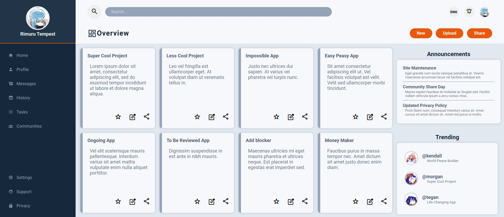
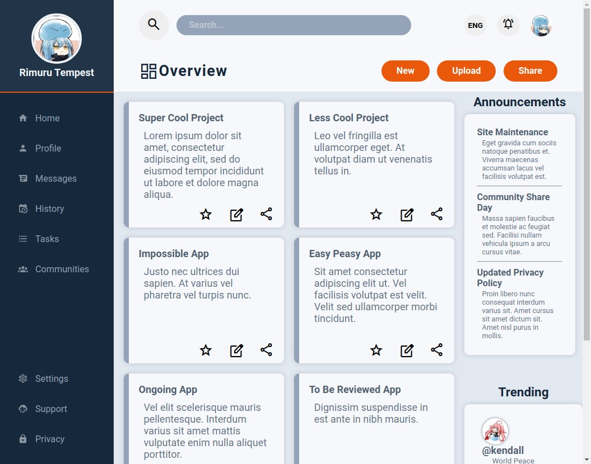

# Admin Dashboard
Now that you’ve had plenty of practice using Grid, we are going to build a full dashboard design. For this project, use whatever tools you need to get it done, but try to lean on Grid for the majority of the layout work. Go back through the lessons or practice assignments if you need a refresher.

## Table of contents
- [Introduction](#introduction)
- [Overview](#overview)
  - [Screenshot](#screenshot)
  - [Built using](#built-using)
  - [Lessons Applied](#lessons-applied)
- [Author](#author)
- [Acknowledgement](#acknowledgement)
## Introduction
- This is my solution to the second and final project for Intermediate HTML and CSS Course.
- This webpage is a simple admin dashboard, laid put using CSS Grid. 

## Overview
- Link: [github.com/kierhb/top-admin-dashboard](https://github.com/kierhb/top-admin-dashboard)

### Screenshot

### Built using

- HTML5 markup
- CSS

### Lessons Applied:

- for HTML:
    - Form Basics
- for CSS:
    - CSS Units
    - Online Font Libraries
    - Text Styles
    - Background, Border-radius, Box shadow and Opacity
    - Advance Selectors
    - Positioning
    - CSS Functions
    - Custom Properties
    - CSS Flexbox
    - CSS Grid: 
        - grid-template
        - repeat
        - auto-fit
        - minmax

## Author

- GitHub - [@kierhb](https://github.com/kierhb)
- LinkedIn - [Kier Bobila](https://www.linkedin.com/in/kier-bobila/)

## Acknowledgement
I want to acknowledge all members of [The Odin Project](https://www.theodinproject.com/) community and also the instructor of [Learn CSS Grid on Scrimba](https://scrimba.com/learn/cssgrid) Mr. Per Borgen.